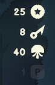
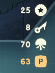

## Paragon

This mod extends game replayability once you have defeated the end boss by adding:
* Paragon level progression, which is slightly inspired by Diablo 3 Paragon system.
* Endless run mode

---

### Paragon

> Paragon mode allows you to play "Paragon runs" where game difficulty is proportionally increased\
> in relation to your Paragon level. You will be rewarded by a score bonus at the end of the run.

> Paragon is unlocked when you have successfully completed the game once.\
> You will then see your current Paragon level at the top right of the screen.\
> 

> Paragon is disabled by default which means that if you want switch to a "Paragon run"\
> you will have to activate or deactivate it by pressing `[P]` on your keyboard.\
> Your Paragon level will change color depending on "Paragon run" activation.\
>  

> Paragon level progression is stored in your savegame, so it will remain upon game sessions.

> You will gain a Paragon level after each successfully completed run.

### Endless

> Endless mode allows you to play an endless and challenging run where difficulty in increased.

> Endless mode is disabled by default which means that if you want switch to an "Endless run"\
> you will have to activate or deactivate it by pressing `[L]` on your keyboard.

---

### Notes

* This mod is in an early stage.
* So far, network has **not** been tested
* Since the mod modifies your savegame, it _could_ be corrupted.\
  Please make a **backup** of your savegame located here:\
  `%userprofile%\appdata\locallow\Fika Productions\ShipOfFools\<id>\<another_id>\save.bin`\
  If Steam Cloud storage is enabled, you **must** [download your savegame from Steam Cloud](https://www.howtogeek.com/428491/how-to-download-your-save-games-from-steam-cloud/).

---

### Installation

* Download the latest [BepInEx 5.x](https://github.com/BepInEx/BepInEx/releases/tag/v5.4.21) (x64)
* Extract the zip content at the root of the Ship of Fools root folder.
> Make sure that you have not created a subfolder, it must look exactly like this:
> ```
> <Ship_of_Fools_Root_folder>
> ├───BepInEx
> ├───MonoBleedingEdge
> ├───ShipOfFools_Data
> └───...
> ```
* Run the game once and stop it, new folders should have been created in BepInEx.
> ```
> <Ship_of_Fools_Root_folder>
> ├───BepInEx
> │   ├───cache
> │   ├───config
> │   ├───core
> │   ├───patchers
> │   ├───plugins
> ├───MonoBleedingEdge
> ├───ShipOfFools_Data
> └───...
> ```
* Download the latest release of this mod on [GitHub](https://github.com/laymain/ship-of-fools-mods/releases)
or [NexusMods](https://www.nexusmods.com//mods/2&game_id=5178)
* Copy `ParagonMod.dll` file into the `<Ship_of_Fools_Root_folder>\BepInEx\plugins` folder.
* Start the game and enjoy this mod.

---

### Bug report

Please report any bug on [GitHub](https://github.com/laymain/ship-of-fools-mods/issues) or reach me on the [official Ship of Fools discord](https://discord.gg/gSnbGNheRk).
